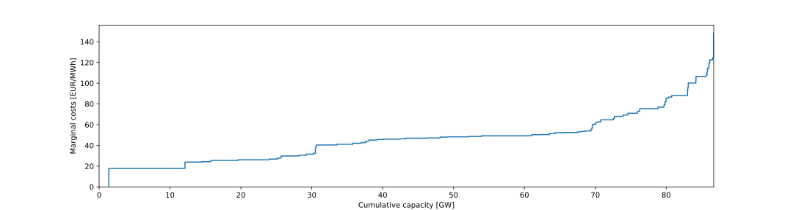
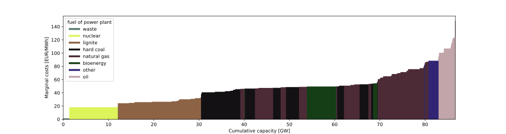

===========
Usage guide
===========

THIS CHAPTER IS WORK IN PROGRESS...

.. contents::
    :depth: 2
    :local:
    :backlinks: top

.. _deflex_scenario:

DeflexScenario
--------------

The scenario class :py:class:`~deflex.scenario.DeflexScenario` is a central
element of deflex.

All input data is stored as a dictionary in the ``input_data`` attribute of the
``DeflexScenario`` class. The keys of the ``dictionary`` are names of the data
table and the values are ``pandas.DataFrame`` or ``pandas.Series`` with the
data.

.. image:: https://raw.githubusercontent.com/reegis/deflex/master/docs/images/deflex_scenario_class.svg

Load input data
~~~~~~~~~~~~~~~

At the moment, there are two methods to populate this attribute from files:

* read_csv() - read a directory with all needed csv files.
* read_xlsx() - read a spread sheet in the ``.xlsx``

To learn how to create a valid input data set see "REFERENCE".

.. code-block:: python

    from deflex import scenario
    sc = scenario.DeflexScenario()
    sc.read_xlsx("path/to/xlsx/file.xlsx")
    # OR
    sc.read_csv("path/to/csv/dir")

Solve the energy system
~~~~~~~~~~~~~~~~~~~~~~~

A valid input data set describes an energy system. To optimise the dispatch
of the energy system a external solver is needed. By default the CBC solver is
used but different solver are possible (see:
`solver <https://pyomo.readthedocs.io/en/stable/solving_pyomo_models.html#supported-solvers>`_).

The simplest way to solve a scenario is the ``compute()`` method.

.. code-block:: python

    sc.compute()

To use a different solver one can pass the ``solver`` parameter.

.. code-block:: python

    sc.compute(solver="glpk")

Store and restore the scenario
~~~~~~~~~~~~~~~~~~~~~~~~~~~~~~

The ``dump()`` method can be used to store the scenario. a solved scenario will
be stored with the results. The scenario is stored in a binary format and it is
not human readable.

.. code-block:: python

    sc.dump("path/to/store/results.dflx")

To restore the scenario use the ``restore_scenario`` function:

.. code-block:: python

    sc = scenario.restore_scenario("path/to/store/results.dflx")

Analyse the scenario
~~~~~~~~~~~~~~~~~~~~

Most analyses cannot be taken if the scenario is not solved. However, the merit
order can be shown only based on the input data:

.. code-block:: python

    from deflex import DeflexScenario
    from deflex import analyses
    sc = DeflexScenario()
    sc.read_xlsx("path/to/xlsx/file.xlsx")
    pp = analyses.merit_order_from_scenario(sc)
    ax = plt.figure(figsize=(15, 4)).add_subplot(1, 1, 1)
    ax.step(pp["capacity_cum"].values, pp["costs_total"].values, where="pre")
    ax.set_xlabel("Cumulative capacity [GW]")
    ax.set_ylabel("Marginal costs [EUR/MWh]")
    ax.set_ylim(0)
    ax.set_xlim(0, pp["capacity_cum"].max())
    plt.show()

With the `de02_co2-price_var-costs.xlsx` from the examples the code above will
produce the following plot:

Filling the area between the line and the x-axis with colors according the fuel
of the power plant oen get the following plot:

IMPORTANT: This is just an example and not a source for the actual merit order
in Germany.

Results
-------

All results are stored in ther
:py:attr:`~deflex.scenario.Scenario.results` attribute of the
:py:class:`~deflex.scenario.Scenario` class. It is a dictionary with the
following keys:

 * main -- Results of all variables
 * param -- Input parameter
 * meta -- Meta information and tags of the scenario
 * problem -- Information about the linear problem such as `lower bound`,
   `upper bound` etc.
 * solver -- Solver results
 * solution -- Information about the found solution and the objective value

The ``deflex`` package provides some analyse functions as described below but
it is also possible to write your own post processing. See the
`results chapter of the oemof.solph documentation
<https://oemof-solph.readthedocs.io/en/latest/usage.html#handling-results>`_
to learn how to access the results.

Fetch results
~~~~~~~~~~~~~

To find results file on your hard disc you can use the
:py:func:`~deflex.postprocessing.search_results` function. This function
provides a filter parameter which can be used to filter your own meta tags. The
:py:attr:`~deflex.scenario.Scenario.meta` attribute of the
:py:class:`~deflex.scenario.Scenario` class can store these meta tags in a
dictionary with the tag-name as key and the value.

.. code-block:: python

    meta = {
        "regions": 17,
        "heat": True,
        "tag": "value",
        }

The filter for these tags will look as follows. The values in the filter have
to be strings regardless of the original type:

.. code-block:: python

    search_results(path=TEST_PATH, regions=["17", "21"], heat=["true"])

There is always an ``AND`` connection between all filters and an ``OR``
connectionso within a list. So The filter above will only return results with
17 ``or`` 21 regions ``and`` with the heat-tag set to true. The returning list
can be used as an input parameter to load the results and get a list of results
dictionaries.

.. code-block:: python

    my_result_files = search_results(path=my_path)
    my_results = restore_results(my_result_files)

If a single file name is passed to the
:py:func:`~deflex.postprocessing.restore_results` function a single result will
be returned, otherwise a list.

Get common values from results
~~~~~~~~~~~~~~~~~~~~~~~~~~~~~~

Common values are emissions, costs and energy of the flows. The function
:py:func:`~deflex.analyses.get_flow_results` returns a MultiIndex
DataFrame with the costs, emissions and the energy of all flows. The values
are absolute and specific. The specific values are divided by the power so
that the specific power gives you the status (on/off).

At the moment this works only with hourly time steps. The units are as flows:

 * absolute emissions -> tons
 * specific emissions -> tons/MWh
 * absolute costs -> EUR
 * specific costs -> EUR/MWh
 * absolute energy -> MWh
 * specific energy -> --

The resulting table of the function can be stored as a ``.csv`` or ``.xlsx``
file. The input is one results dictionary:

.. code-block:: python

   from deflex import postprocessing as pp
   from deflex.analyses import get_flow_results

   my_result_files = pp.search_results(path=my_path)
   my_results = pp.restore_results(my_result_files[0])
   flow_results = get_flow_results(my_result)
   flow_results.to_csv("/my/path/flow_results.csv")

The resulting table can be used to calculate other key values in your own
functions but you can also use some ready-made functions. Follow the link to
get information about each function:

 * :py:func:`~deflex.analyses.calculate_market_clearing_price`
 * :py:func:`~deflex.analyses.calculate_emissions_most_expensive_pp`

We are planing to add more calculations in the future. Please let us know if
you have any ideas and open an `issue <https://github.com/reegis/deflex>`_.
All these functions above are integrated in the
:py:func:`~deflex.analyses.get_key_values_from_results` function. This function
takes a list of results and returns one MultiIndex DataFrame. It contains all
the return values from the functions above for each scenario. The first column
level contains the value names and the second level the names of the scenario.
The value names are:

    * mcp
    * emissions_most_expensive_pp

The name of the scenario is taken from the ``name`` key of the meta attribute.
If this key is not available you have to set it for each scenario, otherwise
the function will fail. The resulting table can be stored as a ``.csv`` or
``.xlsx`` file.

.. code-block:: python

   from deflex import postprocessing as pp
   from deflex.analyses import get_flow_results

   my_result_files = pp.search_results(path=my_path)
   my_results = pp.restore_results(my_result_files)
   kv = get_key_values_from_results(my_results)
   kv.to_csv("/my/path/key_values.csv")

If you have many scenarios, the resulting table may become quite big.
Therefore, you can skip values you do not need in your resulting table. If you
do need only the emissions and not the market clearing price you can exclude
the ``mcp``.

.. code-block:: python

    kv = get_key_values_from_results(my_results, mcp=False)

Parallel computing of scenarios
-------------------------------

For the typical work flow (creating a scenario, loading the input data,
computing the scenario and storing the results) the
:py:func:`~deflex.main.model_scenario` function can be used.

To collect all scenarios from a given directory the function
:py:func:`~deflex.main.fetch_scenarios_from_dir` can be used. The function will
search for ``.xlsx`` files or paths that end on ``_csv`` and cannot
distinguish between a valid scenario and any ``.xlsx`` file or paths that
accidentally contain ``_csv``.

No matter how you collect a list of a scenario input data files the
:py:func:`~deflex.main.batch_model_scenario` function makes it easier to run
each scenario and get back the relevant information about the run. It is
possible to ignore exceptions so that the script will go on with the following
scenarios if one scenario fails.

If you have enough memory and cpu capacity on your computer/server you can
optimise your scenarios in parallel. Use the
:py:func:`~deflex.main.model_multi_scenarios` function for this task. You can
pass a list of scenario files to this function. A cpu fraction will limit the
number of processes as a fraction of the maximal available number of cpu cores.
Keep in mind that for large models the memory will be the limit not the cpu
capacity. If a memory error occurs the script will stop immediately. It is not
possible to catch a memory error. A log-file will log all failing and
successful runs.

.. include:: input_data.rst
